# Real-Time Data Integration Platform

An end-to-end, self-hosted data platform for a retail chain: streaming ingestion with **Apache Kafka + Apache Flink**, an operational store in **PostgreSQL**, file ingestion through **Streamlit + MinIO**, and an analytical warehouse in **ClickHouse** modelled with **dbt** (SCD2) and orchestrated by **Apache Airflow** — everything containerised with Docker Compose behind **Traefik** with **Keycloak** SSO and centralised logging on the **EFK** stack.

Built from scratch as my engineering thesis at the Polish-Japanese Academy of Information Technology (*"Integracja danych strumieniowych w czasie rzeczywistym"*, defended July 2026) and deployed on a single VPS.

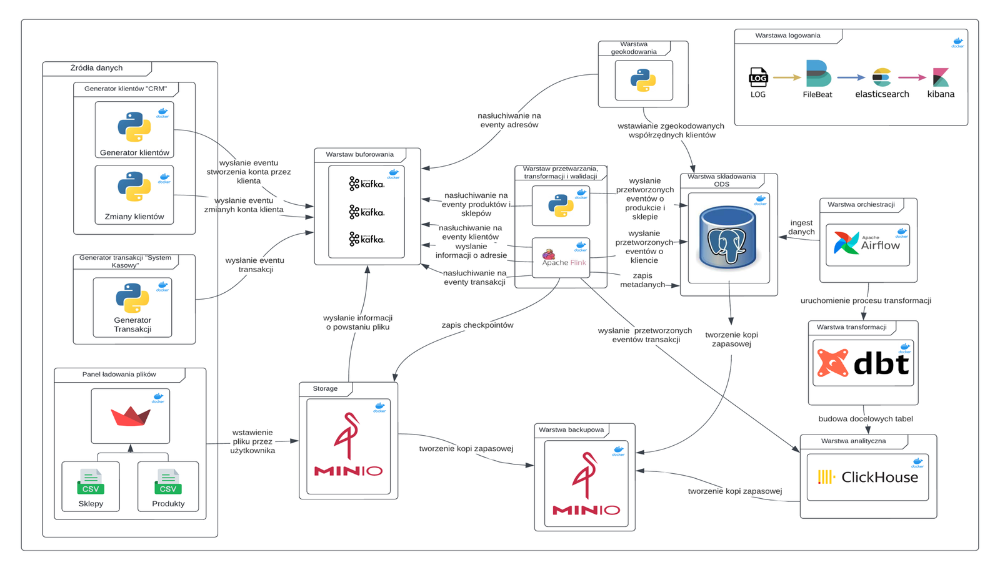

*Full system architecture (diagram labels in Polish — an English overview is below).*

---

## Table of contents

- [What it does](#what-it-does)
- [Architecture](#architecture)
- [How it works](#how-it-works)
- [Data model](#data-model)
- [Tech stack](#tech-stack)
- [Repository layout](#repository-layout)
- [Running the platform](#running-the-platform)
- [Operations](#operations)
- [Tests and results](#tests-and-results)
- [Screenshots](#screenshots)
- [Hardware requirements](#hardware-requirements)
- [Roadmap](#roadmap)
- [Author](#author)

---

## What it does

The platform simulates and integrates the data of a retail chain that has no data infrastructure of its own, and turns it into analytics-ready data:

- **Real-time sales stream** — a transaction generator produces POS events per store (one thread per store, HIPER/SUPER formats with different frequencies, realistic basket sizes, payment mixes, loyalty cards and discounts).
- **Real-time CRM stream** — generators produce customer registrations and eleven kinds of account changes (address, phone, loyalty status, subscriptions, languages, indicators …).
- **Reference data by file** — an authorised user uploads product and store CSVs through a Streamlit panel; the file is validated against a YAML data contract before it is accepted.
- **Stream processing** — Flink jobs validate, split, enrich and persist events with exactly-once checkpointing; invalid records go to dead-letter tables instead of being dropped.
- **Address geocoding** — a Python service turns customer addresses into coordinates asynchronously, driven by a Kafka topic.
- **Analytics** — incremental (watermark-based) loads into ClickHouse, then dbt builds silver views, **SCD2** gold dimensions and the final marts an analyst queries.
- **Security & observability** — one identity provider (Keycloak) in front of every UI, role-based access (analyst vs. administrator), all container and Airflow logs searchable in Kibana, daily database backups to a separate MinIO instance.

## Architecture

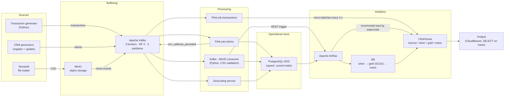

The system is split into five functional layers — sources, buffering, processing, storage, analytics — plus an infrastructure layer (Traefik, Keycloak, EFK, backups). Every component runs in its own container on a shared `traefik_network` Docker network, so any part can be restarted or upgraded on its own.

## How it works

### Streaming path (transactions and customers)

1. Generators publish JSON events to Kafka topics `transactions` and `clients`. Every topic has 3 partitions replicated across all 3 brokers, and a write is acknowledged only when at least 2 brokers have stored it (`min.insync.replicas = 2`).
2. **`job-clients`** (Flink) reads the main stream and a retry stream and merges them with `union()`, so records that previously failed are reprocessed without a separate pipeline. `ClientValidatorRequiredFields` checks the account, contact channels and languages; rejected records go to a side output and land in `meta.client_dead_letter` with the reason. Valid records are written to PostgreSQL by `AccountSink` (`INSERT … ON CONFLICT DO UPDATE`) and then fan out into eight independent branches (nationalities, contacts, subscriptions, digital access, loyalty status, customer indicators, addresses, languages), each with its own validator and sink.
3. After an address is persisted, the job publishes to `crm_address_persisted`; the **geocoding service** consumes that topic and updates the record with coordinates.
4. **`job-transactions`** (Flink) validates sales events, writes failures to the dead-letter table and loads facts into ClickHouse in **4-second micro-batches** instead of single inserts, which keeps the write load on the engine low.
5. Fault tolerance: checkpointing in `EXACTLY_ONCE` mode every 30 s (60 s timeout, max 1 concurrent, 10 s min pause), state persisted to MinIO under `s3://crm/checkpoints` and `s3://transaction/checkpoints`, restart strategy of 3 failures per 5 minutes with a 10 s delay. Kafka auto-commit is disabled everywhere; offsets are committed only after the data is safely stored.

### File path (product and store reference data)

1. The Streamlit panel validates the uploaded CSV against the YAML contract (required columns, types, nullability) and rejects a non-conforming file with a precise message.
2. A valid file is stored in MinIO with metadata including a **correlation id** that follows it through the rest of the pipeline.
3. MinIO emits an event to the Kafka topic `minio-events`.
4. The **Kafka→MinIO consumer** resolves the target schema from the object path (`product/…`, `store/…`), reads the file with Pandas, validates row by row, and performs two batch inserts: valid rows into the ODS table, invalid rows into the matching `*_dead_letter` table. The outcome (`success` / `partial_success` / `error`, rows loaded, rows rejected) is written to `meta.{schema}_etl_load_log`.
5. The consumer triggers the right Airflow DAG over the REST API, archives the file to the `archive` bucket and only then commits the Kafka offset manually — so a crash in between means the file is processed again rather than lost. Processing is retried up to three times before the message is skipped.

### Analytical path

- **Airflow** builds the ingestion DAGs from YAML configuration through an `IngestFactory` class. `bronze_product_ingest` and `bronze_store_ingest` are event-driven (triggered by the consumer); `bronze_client_ingest` runs `@hourly` because customer data changes continuously.
- Each ingestion DAG reads the watermark from `meta.bronze_watermark`, pulls only rows with `updated_at > watermark AND updated_at <= now()` (ClickHouse reads PostgreSQL directly through the `postgresql()` table function), appends them to the bronze layer, stores the new watermark as the minimum of the run timestamps, and finally triggers the matching dbt DAG with `wait_for_completion=True`.
- Every ODS table has an index on `updated_at` and a `BEFORE UPDATE` trigger calling `set_updated_at()`, so incremental loading can never miss a change because of a forgotten timestamp update.
- **dbt** (run on demand in a container through `DockerOperator`) transforms in three layers: **silver** staging views, **gold** SCD2 dimensions, **marts** final dimension and fact tables (current + `*_history`).
- At `02:00` the `scheduler_bronze_ingest` DAG runs all three bronze DAGs in parallel and then rebuilds every mart with `--full-refresh`.

### SCD2 on ClickHouse

ClickHouse has no efficient row-level `UPDATE`, so slowly changing dimensions are implemented with `ReplacingMergeTree(dbt_updated_at)` and an incremental **append** strategy: dbt only ever inserts rows and the engine deduplicates asynchronously. Each row carries `dbt_valid_from`, `dbt_valid_to`, `is_current` and `_row_hash` (MD5 over all tracked fields; array fields are sorted first so that re-ordering does not create a false version). Open records use the sentinel `2106-02-07 06:28:15` — the maximum `DateTime` value in ClickHouse.

On every run the model builds a `source` CTE (with `argMax(field, updated_at)` for keys with multiple entries), reads the currently open rows from the target, detects changes by comparing `_row_hash`, and emits two sets combined with `UNION ALL`: closed versions of changed rows (`is_current = 0`, `dbt_valid_to = now()`) and new versions plus brand-new keys. Marts read the gold layer with `FINAL` to force deduplication before serving results.

The macro `ensure_all_scd_tables` creates the 14 SCD2 tables with the correct engines and sorting keys on `on-run-start`, because ClickHouse requires the target table to exist before an append.

## Data model

**Operational store (PostgreSQL, 3NF)** — separate schemas for `client`, `product`, `store`, `transaction` and `meta` (load logs, watermarks, dead letters). Writes are upserts, so the ODS is always a snapshot of the current state, not a history.

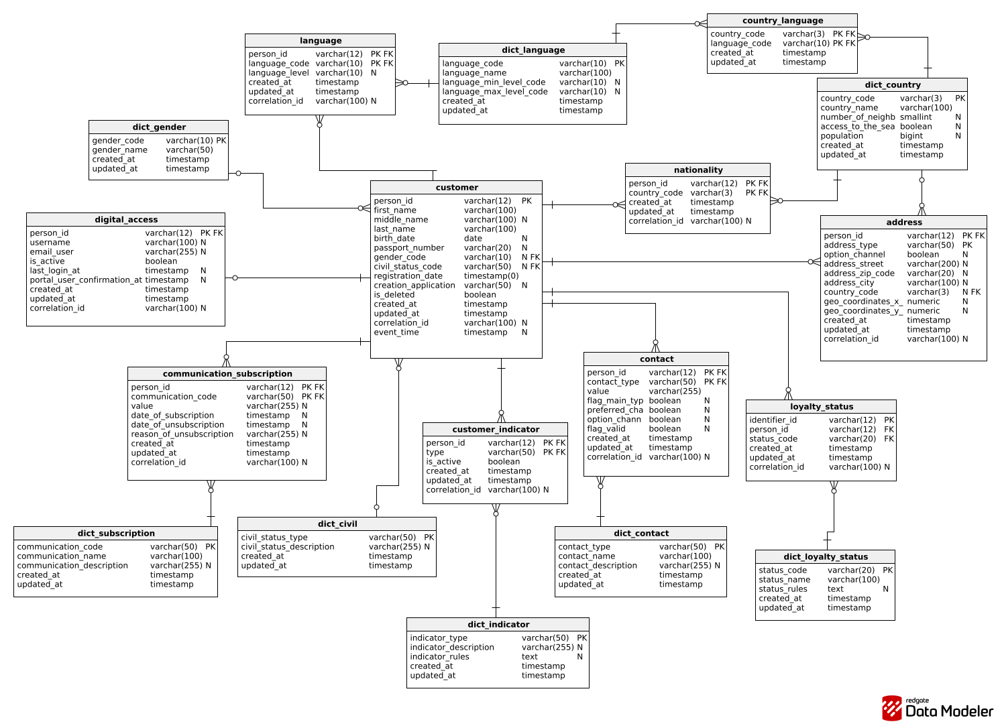

**Warehouse (ClickHouse)** — dimensional model combined with a one-big-table approach: transaction lines are kept in arrays inside `fct_transactions`, which removes most joins from analytical queries.

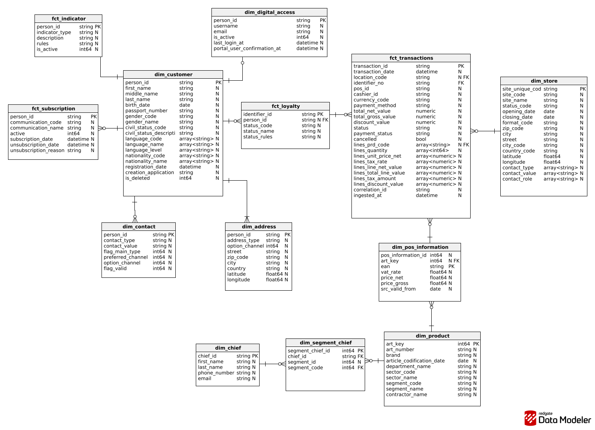

## Tech stack

| Layer | Technology |
|---|---|
| Streaming | Apache Kafka (3 brokers, KRaft), Redpanda Console |
| Stream processing | Apache Flink 1.20.3 (Java 17, multi-module Maven project) |
| Operational store | PostgreSQL 16 |
| Object storage | MinIO (source, archive, checkpoints, backups) |
| Warehouse | ClickHouse 25.3 (MergeTree / ReplacingMergeTree) |
| Transformations | dbt 1.8 (`dbt-clickhouse`), custom SCD2 models and macros |
| Orchestration | Apache Airflow 2.10 (DAG factory, `DockerOperator`, REST-triggered DAGs) |
| Apps & services | Python 3.11 (Streamlit, Pandas, Pydantic, Faker, Kafka & MinIO clients) |
| Ingress & identity | Traefik (HTTPS, Let's Encrypt), Keycloak 26, `traefik-forward-auth` |
| Observability | Elasticsearch + Filebeat + Kibana |
| SQL access | CloudBeaver |
| Runtime | Docker / Docker Compose on a single Ubuntu VPS |

## Repository layout

```
airflow/      Airflow stack: DAGs, IngestFactory, YAML table configs
api/          FastAPI CRM service (Pydantic models, Kafka producer)
backup/       Second MinIO instance used as the backup target
clickhouse/   Warehouse container and configuration
cloudbeaver/  SQL client exposed to analysts
dbt/          dbt project: silver / gold (SCD2) / marts models, macros, Dockerfile
elk/          Elasticsearch, Filebeat and Kibana
flink/        Flink cluster (custom image with the S3 plugin and JSON logging)
kafka/        3-broker Kafka cluster + Redpanda Console
minIO/        Object storage and Kafka event notifications
ods/          PostgreSQL operational data store
service/
  crm_generator/          customer registration and account-update generators
  transaction_generator/  POS transaction generator
  flink_processing/       Maven project: common, job-clients, job-transactions
  kafka_minio_consumer/   CSV validation and load into the ODS
  geocoding_crm_address/  address → coordinates service
  streamlit/              file upload panel with data contracts
sql/          ODS schemas, seed data, ClickHouse gold schema
traefik/      Reverse proxy, TLS and forward-auth middlewares
```

## Running the platform

> Detailed deployment notes (DNS records, shared secrets, SSO configuration, smoke tests) are in [`docs/DEPLOYMENT.md`](docs/DEPLOYMENT.md).

### Prerequisites

- Docker with Compose v2
- JDK 17 and Apache Maven (to build the Flink jobs)
- A domain with DNS pointing at the host, if you want the Traefik + Keycloak setup with real certificates

Everything else is installed inside the images.

### 1. Configuration

No real secrets are committed. Every service ships a `.env.example`; create a `.env` next to it and fill in the values:

```bash
find . -name '.env.example' | while read f; do cp -n "$f" "${f%.example}"; done
```

Passwords shared between services (ODS, MinIO, ClickHouse) must match across the files — see `docs/DEPLOYMENT.md`.

### 2. Shared network

```bash
docker network create traefik_network
```

### 3. Start the stack in order

```bash
cd traefik                     && docker compose up -d
# keycloak                     -> identity provider, see the note below
cd kafka                       && docker compose up -d
cd ../minIO                    && docker compose up -d
cd ../ods                      && docker compose up -d
cd ../clickhouse               && docker compose up -d
cd ../flink                    && docker compose up -d
cd ../airflow                  && docker compose up -d
cd ../elk                      && docker compose up -d
cd ../cloudbeaver              && docker compose up -d
cd ../backup                   && docker compose up -d
cd ../service/streamlit        && docker compose up -d
cd ../kafka_minio_consumer     && docker compose up -d
cd ../geocoding_crm_address    && docker compose up -d
cd ../transaction_generator    && docker compose up -d
cd ../crm_generator/producer   && docker compose up -d
cd ../updater                  && docker compose up -d
```

The order matters: MinIO registers its Kafka notification target at start-up, and the processing services expect the databases to be up.

> **Keycloak** — the identity provider stack and its realm export are environment-specific (they contain real user accounts) and are kept outside this repository. Without them the platform runs exactly the same; only the SSO-protected routes in front of the UIs are inactive. `docs/DEPLOYMENT.md` describes how the layer is wired.

### 4. Build and submit the Flink jobs

The Flink cluster runs a custom image (`flink/Dockerfile`) that adds the S3 filesystem plugin and JSON logging. Put `flink-s3-fs-hadoop-1.20.3.jar` in `flink/plugins/` and the log4j JSON layout jar in `flink/conf/` (both are git-ignored), then:

```bash
cd service/flink_processing
mvn clean && mvn package
```

The build produces `job-clients-1.0-SNAPSHOT.jar` and `job-transactions-1.0-SNAPSHOT.jar` in the modules' `target/` directories, which are mounted into the cluster under `/opt/flink/usrlib`. Submit both jobs:

```bash
docker exec flink-jobmanager flink run -d \
  -c TransactionProcessingJob \
  /opt/flink/usrlib/transactions/job-transactions-1.0-SNAPSHOT.jar

docker exec flink-jobmanager flink run -d \
  -c ClientProcessingJob \
  /opt/flink/usrlib/clients/job-clients-1.0-SNAPSHOT.jar
```

### 5. Build the dbt image

dbt is not a long-running service — Airflow starts a short-lived container per task, so the image has to exist first. The tag must match `DBT_IMAGE` in `airflow/.env`:

```bash
docker build -t engineering-dbt:1.10 ./dbt
```

### 6. Verify

```bash
docker ps
docker logs flink-jobmanager --tail 20      # jobs should be RUNNING
```

The stack is up when the Streamlit panel and the other UIs (Redpanda Console, MinIO, Kibana, Airflow) answer through Traefik and ask for a Keycloak login.

## Operations

**Schedules**

| DAG | Schedule | What it does |
|---|---|---|
| `bronze_product_ingest` | event-driven (REST) | Incremental load of product tables into ClickHouse bronze, then dbt |
| `bronze_store_ingest` | event-driven (REST) | Same for store tables |
| `bronze_client_ingest` | `@hourly` | Same for customer tables |
| `scheduler_bronze_ingest` | `0 2 * * *` | Runs all three bronze DAGs, then `dbt_marts` with `--full-refresh` |
| `database_backup` | `0 4 * * *` | `pg_dump` of the ODS and a native ClickHouse `BACKUP` to the backup MinIO |

**Access control** — two `traefik-forward-auth` instances share one Keycloak realm: the administrator instance protects Traefik, Kibana, the MinIO console and Redpanda Console; the analyst instance protects CloudBeaver only. An analyst therefore reaches the SQL client and nothing else, and has `SELECT` on the marts layer only. Services keep their own authentication as a second, independent layer.

**Logging** — Filebeat collects container output through Docker autodiscover plus Airflow task logs from a shared volume, and ships them to Elasticsearch (daily `logs-{date}` indices) for analysis in Kibana.

**Backups** — a dedicated MinIO instance separate from the operational one, with 30-day retention on both the local dumps and the uploaded copies.

## Tests and results

Functional and non-functional tests covered the data contract, the Pydantic validation, MinIO → Kafka notifications, delivery guarantees, geocoding, SCD2 versioning, throughput and access control. Highlights:

- **No data loss** — with a consumer stopped, messages accumulated in Kafka and were fully processed after the restart; database counts matched.
- **Throughput** — with the generator pushed to >400 events/s, the pipeline sustained the load for a 5-minute run and processed **~178 000 transactions** (≈600 events/s) with no backpressure-driven failures and no lost events.
- **Data quality** — a malformed CSV is rejected at upload, and a single bad row is written to the matching `*_dead_letter` table with its reason while the rest of the file loads.
- **SCD2** — changing a customer address closed the previous version and opened a new one with correct `valid_from` / `valid_to` in the warehouse.
- **Access control** — an analyst is let into CloudBeaver and refused everywhere else, with a single Keycloak sign-in.

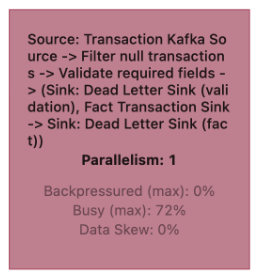

## Screenshots

| | |
|---|---|
| 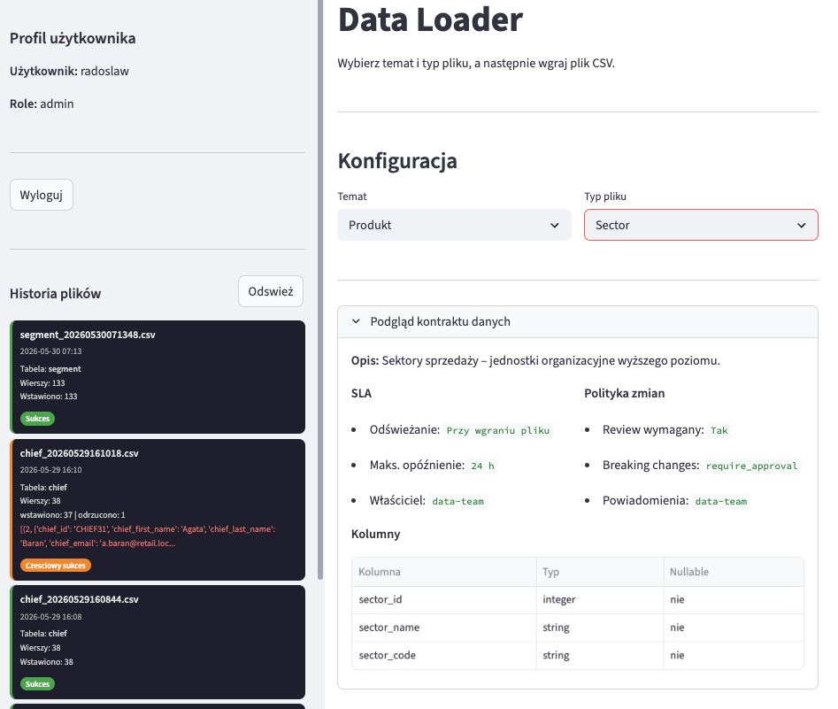 **Streamlit loader** — data contract preview, load history, per-file status | 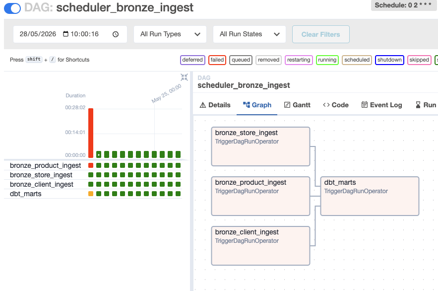 **Airflow** — nightly `scheduler_bronze_ingest` run |
| 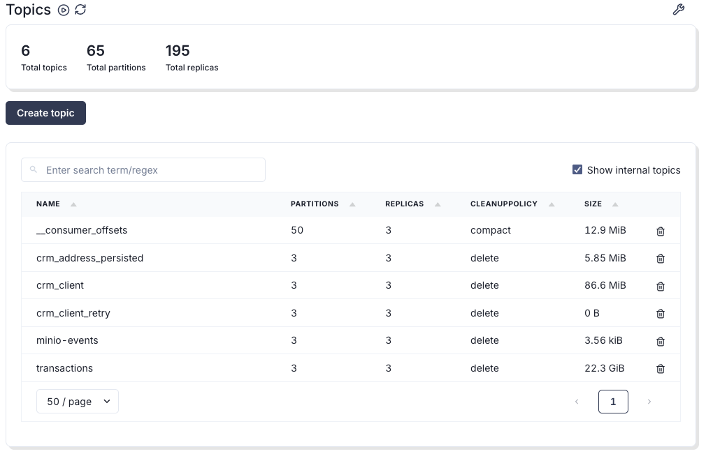 **Redpanda Console** — topics and partitions | 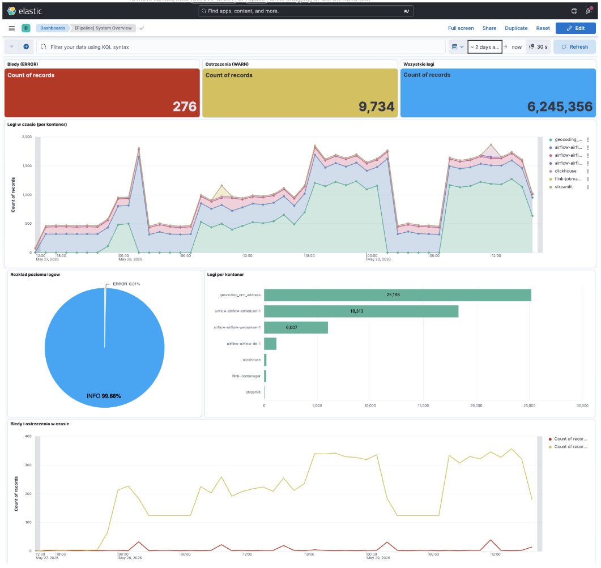 **Kibana** — centralised logs from all containers |
| 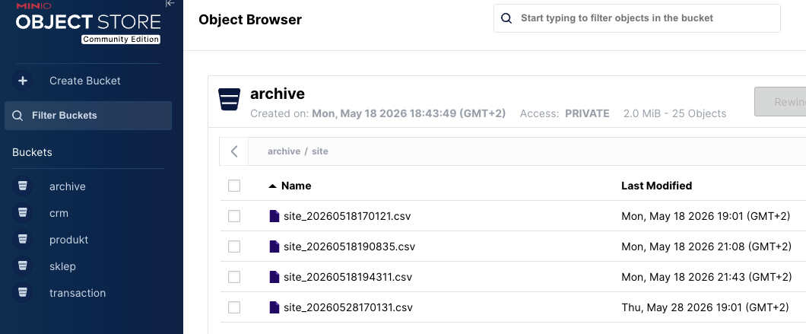 **MinIO** — uploaded files and archive | 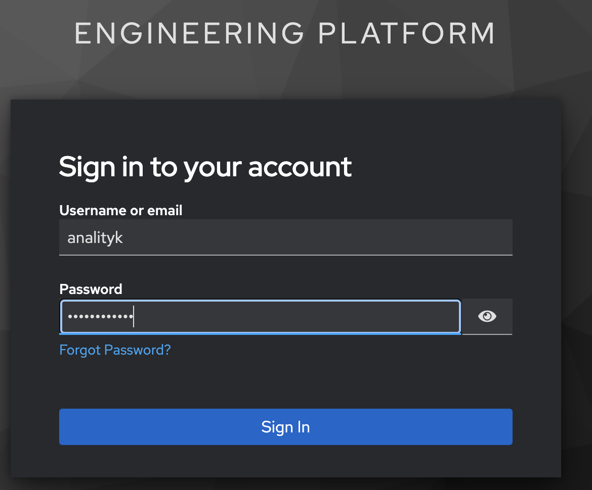 **Keycloak** — single sign-on in front of every UI |

Data flow (DFD level 1):

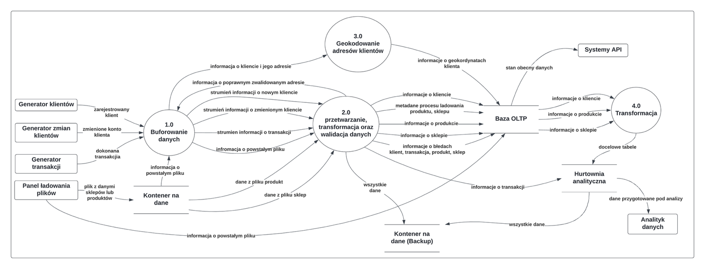

## Hardware requirements

The platform runs several dozen containers at once. The development VPS had **24 GB RAM, 8 vCPU and 200 GB disk**; normal operation used about 16 GB RAM, peaks around 20 GB.

Disk turned out to be the real bottleneck — with the generators running unthrottled, 200 GB filled up within a week (Kafka retention, Elasticsearch indices, MinIO files, incremental data in ClickHouse and PostgreSQL). Retention was cut to 2 days in Kafka and an object lifecycle policy added in MinIO. For production, start from ~2 TB with separate volumes and retention policies for Kafka, ClickHouse and MinIO, 64 GB RAM for concurrent analytical queries, and at least 16 cores.

## Roadmap

- A BI layer (dashboards on top of the ClickHouse marts)
- A REST API to trigger pipelines and check their status from outside the stack
- Alerting and richer dashboards on top of the EFK stack
- VPS resource monitoring (CPU, memory, disk) with early warnings

## Author

**Radosław Grzęda** — data analyst moving into data engineering.
[LinkedIn](https://www.linkedin.com/in/rados%C5%82aw-grz%C4%99da-03605127b/) · [GitHub](https://github.com/RadoslawGrzeda)

The diagrams and screenshots come from my engineering thesis, *Integracja danych strumieniowych w czasie rzeczywistym* (PJATK, 2026).
